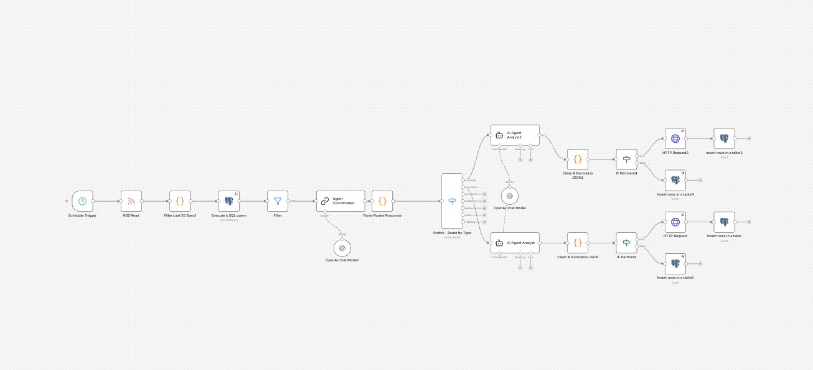
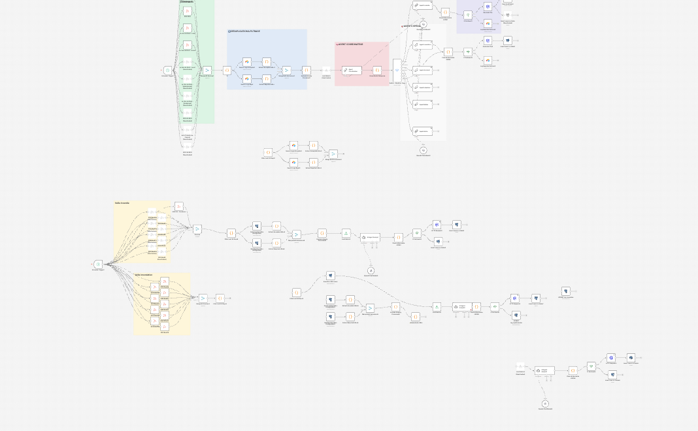

## Getting Started

First, run the development server:

```bash
npm run dev
# or
yarn dev
# or
pnpm dev
# or
bun dev
```

Open [http://localhost:3000](http://localhost:3000) with your browser to see the result.

You can start editing the page by modifying `app/page.tsx`. The page auto-updates as you edit the file.

This project uses [`next/font`](https://nextjs.org/docs/app/building-your-application/optimizing/fonts) to automatically optimize and load [Geist](https://vercel.com/font), a new font family for Vercel.

## Learn More

To learn more about Next.js, take a look at the following resources:

- [Next.js Documentation](https://nextjs.org/docs) - learn about Next.js features and API.
- [Learn Next.js](https://nextjs.org/learn) - an interactive Next.js tutorial.

You can check out [the Next.js GitHub repository](https://github.com/vercel/next.js) - your feedback and contributions are welcome!

## Deploy on Vercel

The easiest way to deploy your Next.js app is to use the [Vercel Platform](https://vercel.com/new?utm_medium=default-template&filter=next.js&utm_source=create-next-app&utm_campaign=create-next-app-readme) from the creators of Next.js.

Check out our [Next.js deployment documentation](https://nextjs.org/docs/app/building-your-application/deploying) for more details.


## Setup N8N Workflow 

Installer model ia avec llm studio pour faire tourner en local

Puis copier coller ses workflow:


WORKFLOW UTILISE POUR LES TEST INCENDIE LA BASE LA PLUS SOLIDE 

{
  "nodes": [
    {
      "parameters": {
        "promptType": "define",
        "text": "=Tu es un analyste OSINT expert en sécurité civile. Ton rôle est de filtrer des flux d'actualités pour identifier des sinistres RÉELS dans les Hauts-de-France.\n\n### RÈGLES DE VALIDATION GÉOGRAPHIQUE\n1. Vérifie la ville et le département.\n2. NE GARDE QUE si cela se passe dans : Nord (59), Pas-de-Calais (62), Somme (80), Aisne (02), Oise (60).\n3. Si c'est en dehors (ex: Saint-Nazaire, Lyon, etc.), CATEGORY = \"HORS ZONE\".\n\n### RÈGLES DE PERTINENCE (STRICTES)\n- PERTINENT : Incendies (bâtiments, industries, véhicules), explosions, effondrements, inondations avec dégâts.\n- REJET : TOUT le reste. Notamment : prévention, débroussaillement, exercices/formations, commémorations, nouveaux camions, météo, conseils, faits divers sans sinistre matériel.\n- HORS ZONE : Tous ce qui ce passe en dehors des Hauts de France Nord (59), Pas-de-Calais (62), Somme (80), Aisne (02), Oise (60).\n\n### DONNÉES À ANALYSER\nTitre : {{ $('Filter Last 30 Days1').item.json.title }}\nContenu : {{ $('Filter Last 30 Days1').item.json.content }}\nDate de publication : {{ $('Filter Last 30 Days1').item.json.pubDate }}\nURL : {{ $('Filter Last 30 Days1').item.json.url }}\nSource : {{ $('Filter Last 30 Days1').item.json.source }}\n\n### MISSION\nAnalyse si l'article décrit un sinistre réel dans la zone cible. Réponds UNIQUEMENT avec un objet JSON respectant strictement la structure ci-dessous. Ne rajoute aucun texte avant ou après le JSON.\n\n### STRUCTURE JSON DE SORTIE\n{\n  \"category\": \"PERTINENT ou REJET ou HORS ZONE\",\n  \"reason_of_rejection\": \"Si REJET ou HORS ZONE, expliquer pourquoi brièvement, sinon null\",\n  \"title\": \"{{ $('Filter Last 30 Days1').item.json.title }}\",\n  \"city\": \"Nom de la ville\",\n  \"identite\": \"Nom prenom si mentionné dans l'article sinon Inconnu\",\n  \"department\": \"Code postal ou numéro de département\",\n  \"rue_sinistre\": \"Nom de la rue ou quartier si disponible, sinon Inconnu\",\n  \"date_event\": \"{{ $('Filter Last 30 Days1').item.json.pubDate }}\",\n  \"Date_sinistre\": \"Date de l'incendie si mentionnée dans l'article sinon Inconnu (ex: Hier, Ce jour, Ce lundi)\",\n  \"Heure_sinistre\": \"Heure du sinistre si mentionnée sinon Inconnu\",\n  \"type_sinistre\": \"Maison/Appartement/Industriel/Véhicule/etc\",\n  \"severity_index\": \"Nombre de 1 à 5 (1: mineur, 5: catastrophe)\",\n  \"resources_deployed\": \"Nombre de pompiers/véhicules mentionnés\",\n  \"summary\": \"Résumé de 3 phrases maximum sans invention de faits\",\n  \"source_url\": \"{{ $('Filter Last 30 Days1').item.json.url }}\",\n  \"source_name\": \"{{ $('Filter Last 30 Days1').item.json.source }}\"\n}",
        "options": {}
      },
      "id": "c349e961-ed47-4478-9ab5-1ec4e8636fb3",
      "name": "AI Agent Analyst2",
      "type": "@n8n/n8n-nodes-langchain.agent",
      "typeVersion": 1.6,
      "position": [
        2192,
        -80
      ]
    },
    {
      "parameters": {
        "url": "https://news.google.com/rss/search?q=incendie+Hauts-de-France+when:7d&hl=fr&gl=FR&ceid=FR:fr",
        "options": {}
      },
      "type": "n8n-nodes-base.rssFeedRead",
      "typeVersion": 1.2,
      "position": [
        496,
        224
      ],
      "id": "d3061e9b-498d-441e-8131-fda393fe07b2",
      "name": "RSS Read"
    },
    {
      "parameters": {
        "rule": {
          "interval": [
            {}
          ]
        }
      },
      "type": "n8n-nodes-base.scheduleTrigger",
      "typeVersion": 1.3,
      "position": [
        272,
        224
      ],
      "id": "53979c60-e0b7-4b3c-8e48-92c0d0a6e19e",
      "name": "Schedule Trigger"
    },
    {
      "parameters": {
        "jsCode": "const unMoisEnMillisecondes = 30 * 24 * 60 * 60 * 1000;\nconst maintenant = new Date().getTime();\n\n// Filtrer les articles du dernier mois\nconst articlesRecents = items.filter(item => {\n  if (!item.json.isoDate && !item.json.pubDate) return false;\n  const dateArticle = new Date(item.json.isoDate || item.json.pubDate).getTime();\n  const difference = maintenant - dateArticle;\n  return difference > 0 && difference < unMoisEnMillisecondes;\n});\n\n// Trier par date décroissante (plus récent en premier)\nreturn articlesRecents.sort((a, b) => {\n  const dateA = new Date(a.json.isoDate || a.json.pubDate).getTime();\n  const dateB = new Date(b.json.isoDate || b.json.pubDate).getTime();\n  return dateB - dateA;\n}).map(item => ({\n  json: {\n    source: item.json.source || item.json.creator || 'Unknown',\n    url: item.json.link || item.json.url || '',\n    title: item.json.title || '',\n    pubDate: item.json.pubDate || item.json.isoDate || '',\n    content: item.json.contentSnippet || item.json.description || item.json.content || ''\n  }\n}));"
      },
      "id": "aaeb32d2-1352-4bdd-84f0-c3cf18347bd4",
      "name": "Filter Last 30 Days1",
      "type": "n8n-nodes-base.code",
      "typeVersion": 2,
      "position": [
        720,
        224
      ],
      "notes": "Filtrage temporel et tri décroissant + normalisation"
    },
    {
      "parameters": {
        "operation": "executeQuery",
        "query": "SELECT COUNT(*) as count FROM (\n  SELECT source_url FROM log_incendies WHERE source_url = $1\n  UNION\n  SELECT source_url FROM log_rejetincendie WHERE source_url = $1\n) AS combined;",
        "options": {
          "queryReplacement": "={{ $json.url }}"
        }
      },
      "type": "n8n-nodes-base.postgres",
      "typeVersion": 2.6,
      "position": [
        944,
        224
      ],
      "id": "751eaeb9-9f0c-4cda-bc90-4ff238ceedc5",
      "name": "Execute a SQL query",
      "alwaysOutputData": true,
      "credentials": {
        "postgres": {
          "id": "j8Ys36OKPpg32jFk",
          "name": "Postgres account"
        }
      }
    },
    {
      "parameters": {
        "conditions": {
          "options": {
            "caseSensitive": true,
            "leftValue": "",
            "typeValidation": "strict",
            "version": 3
          },
          "conditions": [
            {
              "id": "29ee2f94-dbdc-4094-b357-8d5f63e90dfc",
              "leftValue": "={{ $json.count }}",
              "rightValue": "0",
              "operator": {
                "type": "string",
                "operation": "equals"
              }
            }
          ],
          "combinator": "and"
        },
        "options": {}
      },
      "type": "n8n-nodes-base.filter",
      "typeVersion": 2.3,
      "position": [
        1168,
        224
      ],
      "id": "9d9d178d-841c-4a75-8966-836db742f3e5",
      "name": "Filter"
    },
    {
      "parameters": {
        "model": {
          "__rl": true,
          "value": "llama-3.2-3b-instruct",
          "mode": "list",
          "cachedResultName": "llama-3.2-3b-instruct"
        },
        "responsesApiEnabled": false,
        "options": {}
      },
      "type": "@n8n/n8n-nodes-langchain.lmChatOpenAi",
      "typeVersion": 1.3,
      "position": [
        2240,
        208
      ],
      "id": "250c525c-d1d1-4764-aeaf-a1a8a138bbdf",
      "name": "OpenAI Chat Model",
      "credentials": {
        "openAiApi": {
          "id": "RpSfTP1ycP890pRd",
          "name": "OpenAi account"
        }
      }
    },
    {
      "parameters": {
        "promptType": "define",
        "text": "=Tu es un coordinateur OSINT pour la détection de sinistres dans les Hauts-de-France (départements 02, 59, 60, 62, 80).\n\nTYPES DE SINISTRES À DÉTECTER :\n1. INCENDIE - Feux (habitation, véhicule, industriel, forêt)\n2. INONDATION - Débordements, crues, ruissellements, submersions\n3. ACCIDENT - Collisions routières graves avec victimes ou dégâts importants\n4. INDUSTRIEL - Explosions, fuites chimiques, effondrements de bâtiments\n5. METEO - Tempêtes, tornades, grêle majeure, vents violents\n6. AUTRE - Autres incidents nécessitant intervention des pompiers\n\nNE PAS DÉTECTER :\n- Recrutement, concours, formationsæ\n- Tests de matériel, nouveaux véhicules\n- Cérémonies, médailles, hommages\n- Conseils de prévention\n- Prévisions météo simples\n\nARTICLE À ANALYSER :\nTitre : {{ $('Filter Last 30 Days1').item.json.title }}\nContenu : {{ $('Filter Last 30 Days1').item.json.content }}\nDate de publication : {{ $('Filter Last 30 Days1').item.json.pubDate }}\nURL : {{ $('Filter Last 30 Days1').item.json.url }}\nSource : {{ $('Filter Last 30 Days1').item.json.source }}\n\nMISSION :\nAnalyse si cet article concerne un sinistre RÉEL dans les Hauts-de-France.\n\nRÉPONDS UNIQUEMENT par un objet JSON (pas de texte avant ou après) :\n{\n  \"is_incident\": true ou false,\n  \"incident_type\": \"INCENDIE\" ou \"INONDATION\" ou \"ACCIDENT\" ou \"INDUSTRIEL\" ou \"METEO\" ou \"AUTRE\" ou \"NONE\",\n  \"confidence\": 0.0 à 1.0,\n  \"location_mentioned\": \"nom de la ville si trouvée, sinon Inconnu\",\n  \"raw_title\": \"{{ $('Filter Last 30 Days1').item.json.title }}\",\n  \"raw_url\": \"{{ $('Filter Last 30 Days1').item.json.url }}\",\n  \"raw_pubDate\": \"{{ $('Filter Last 30 Days1').item.json.pubDate }}\",\n  \"raw_source\": \"{{ $('Filter Last 30 Days1').item.json.source }}\"\n}",
        "batching": {
          "batchSize": 1,
          "delayBetweenBatches": 2000
        }
      },
      "id": "f25ddca5-f000-4f4c-80bc-3722dc7556c8",
      "name": "Agent Coordinateur",
      "type": "@n8n/n8n-nodes-langchain.chainLlm",
      "typeVersion": 1.9,
      "position": [
        1392,
        224
      ],
      "retryOnFail": false,
      "waitBetweenTries": 1000,
      "executeOnce": false,
      "alwaysOutputData": false,
      "notesInFlow": false,
      "notes": "Agent coordinateur - Détection et routage"
    },
    {
      "parameters": {
        "jsCode": "return $input.all().map(item => {\n  const reponseIA = item.json.text || '';\n  const reponsePropre = reponseIA.replace(/```json/g, '').replace(/```/g, '').trim();\n\n  try {\n    const parsed = JSON.parse(reponsePropre);\n    return {\n      json: {\n        is_incident: parsed.is_incident || false,\n        incident_type: (parsed.incident_type || 'NONE').toUpperCase(),\n        confidence: parseFloat(parsed.confidence) || 0,\n        location_mentioned: parsed.location_mentioned || 'Inconnu',\n        raw_title: parsed.raw_title || item.json.title || '',\n        raw_url: parsed.raw_url || item.json.url || '',\n        raw_pubDate: parsed.raw_pubDate || item.json.pubDate || '',\n        raw_source: parsed.raw_source || item.json.source || '',\n        raw_content: item.json.content || ''\n      }\n    };\n  } catch (error) {\n    return { \n      json: { \n        is_incident: false,\n        incident_type: 'ERREUR',\n        confidence: 0,\n        error_details: error.message\n      } \n    };\n  }\n});"
      },
      "id": "cb14ec38-681d-4341-9221-37fa7eb68dfe",
      "name": "Parse Router Response",
      "type": "n8n-nodes-base.code",
      "typeVersion": 2,
      "position": [
        1648,
        224
      ],
      "notes": "Parsing de la réponse du coordinateur"
    },
    {
      "parameters": {
        "rules": {
          "values": [
            {
              "conditions": {
                "options": {
                  "caseSensitive": true,
                  "leftValue": "",
                  "typeValidation": "strict",
                  "version": 2
                },
                "conditions": [
                  {
                    "leftValue": "={{ $json.is_incident }}",
                    "rightValue": true,
                    "operator": {
                      "type": "boolean",
                      "operation": "true",
                      "singleValue": true
                    },
                    "id": "0a8b90af-895e-4f22-8a15-c2a67601e487"
                  },
                  {
                    "leftValue": "={{ $json.incident_type }}",
                    "rightValue": "INCENDIE",
                    "operator": {
                      "type": "string",
                      "operation": "equals"
                    },
                    "id": "6bb178ef-6c39-4cfc-b691-f2e96624680f"
                  }
                ],
                "combinator": "and"
              },
              "renameOutput": true,
              "outputKey": "incendie"
            },
            {
              "conditions": {
                "options": {
                  "caseSensitive": true,
                  "leftValue": "",
                  "typeValidation": "strict",
                  "version": 2
                },
                "conditions": [
                  {
                    "leftValue": "={{ $json.is_incident }}",
                    "rightValue": true,
                    "operator": {
                      "type": "boolean",
                      "operation": "true",
                      "singleValue": true
                    },
                    "id": "99562ece-ea81-49f1-8445-e4b40e9c0e04"
                  },
                  {
                    "leftValue": "={{ $json.incident_type }}",
                    "rightValue": "INONDATION",
                    "operator": {
                      "type": "string",
                      "operation": "equals"
                    },
                    "id": "5e2a6e5b-3dd1-48fe-b6ac-ab73c6ac5357"
                  }
                ],
                "combinator": "and"
              },
              "renameOutput": true,
              "outputKey": "inondation"
            },
            {
              "conditions": {
                "options": {
                  "caseSensitive": true,
                  "leftValue": "",
                  "typeValidation": "strict",
                  "version": 2
                },
                "conditions": [
                  {
                    "leftValue": "={{ $json.is_incident }}",
                    "rightValue": true,
                    "operator": {
                      "type": "boolean",
                      "operation": "true",
                      "singleValue": true
                    },
                    "id": "328686ea-d440-4b8a-84e3-27beab42f939"
                  },
                  {
                    "leftValue": "={{ $json.incident_type }}",
                    "rightValue": "ACCIDENT",
                    "operator": {
                      "type": "string",
                      "operation": "equals"
                    },
                    "id": "0b5f26e9-8119-4f8f-9526-22449758d9b2"
                  }
                ],
                "combinator": "and"
              },
              "renameOutput": true,
              "outputKey": "accident"
            },
            {
              "conditions": {
                "options": {
                  "caseSensitive": true,
                  "leftValue": "",
                  "typeValidation": "strict",
                  "version": 2
                },
                "conditions": [
                  {
                    "leftValue": "={{ $json.is_incident }}",
                    "rightValue": true,
                    "operator": {
                      "type": "boolean",
                      "operation": "true",
                      "singleValue": true
                    },
                    "id": "be3966b4-fbe9-4a9a-a206-9853aec5f2ab"
                  },
                  {
                    "leftValue": "={{ $json.incident_type }}",
                    "rightValue": "INDUSTRIEL",
                    "operator": {
                      "type": "string",
                      "operation": "equals"
                    },
                    "id": "2ddbc6b8-a321-49d3-9b3c-e3630c7ab01c"
                  }
                ],
                "combinator": "and"
              },
              "renameOutput": true,
              "outputKey": "industriel"
            },
            {
              "conditions": {
                "options": {
                  "caseSensitive": true,
                  "leftValue": "",
                  "typeValidation": "strict",
                  "version": 2
                },
                "conditions": [
                  {
                    "leftValue": "={{ $json.is_incident }}",
                    "rightValue": true,
                    "operator": {
                      "type": "boolean",
                      "operation": "true",
                      "singleValue": true
                    },
                    "id": "44f99382-9619-4e52-bec4-e9db506a49fb"
                  },
                  {
                    "leftValue": "={{ $json.incident_type }}",
                    "rightValue": "METEO",
                    "operator": {
                      "type": "string",
                      "operation": "equals"
                    },
                    "id": "5764e150-b9ed-4373-b7e8-50f335d93dcf"
                  }
                ],
                "combinator": "and"
              },
              "renameOutput": true,
              "outputKey": "meteo"
            },
            {
              "conditions": {
                "options": {
                  "caseSensitive": true,
                  "leftValue": "",
                  "typeValidation": "strict",
                  "version": 2
                },
                "conditions": [
                  {
                    "leftValue": "={{ $json.is_incident }}",
                    "rightValue": true,
                    "operator": {
                      "type": "boolean",
                      "operation": "true",
                      "singleValue": true
                    },
                    "id": "61360c08-11cf-45b6-b6f4-7491df3d8a9d"
                  },
                  {
                    "leftValue": "={{ $json.incident_type }}",
                    "rightValue": "AUTRE",
                    "operator": {
                      "type": "string",
                      "operation": "equals"
                    },
                    "id": "dd14d814-162d-4b82-b54d-9b85d42d9fd4"
                  }
                ],
                "combinator": "and"
              },
              "renameOutput": true,
              "outputKey": "autre"
            }
          ]
        },
        "options": {
          "fallbackOutput": "extra"
        }
      },
      "id": "c15b0dbe-780e-44f1-a502-1c6b2cfb7830",
      "name": "Switch - Route by Type",
      "type": "n8n-nodes-base.switch",
      "typeVersion": 3.2,
      "position": [
        1968,
        144
      ],
      "notes": "Routage vers agents spécialisés"
    },
    {
      "parameters": {
        "model": {
          "__rl": true,
          "value": "qwen2.5-3b-instruct-mlx",
          "mode": "list",
          "cachedResultName": "qwen2.5-3b-instruct-mlx"
        },
        "responsesApiEnabled": false,
        "options": {}
      },
      "type": "@n8n/n8n-nodes-langchain.lmChatOpenAi",
      "typeVersion": 1.3,
      "position": [
        1472,
        448
      ],
      "id": "a29e87a5-4a0e-4fd0-8750-c2e9f2503945",
      "name": "OpenAI Chat Model1",
      "credentials": {
        "openAiApi": {
          "id": "RpSfTP1ycP890pRd",
          "name": "OpenAi account"
        }
      }
    },
    {
      "parameters": {
        "promptType": "define",
        "text": "=Tu es un expert en analyse d'INONDATIONS pour les services d'urgence.\n\nINSTRUCTIONS CRITIQUES :\n- Réponds UNIQUEMENT en JSON pur, sans balise <think>, sans texte explicatif, sans markdown\n- Base-toi STRICTEMENT sur les faits présents dans l'article\n- Si une information n'est pas dans l'article, marque \"Inconnu\" (NE PAS INVENTER)\n- Pas de raisonnement visible, juste le résultat final\n\n### DONNÉES À ANALYSER\nTitre : {{ $('Filter Last 30 Days1').item.json.title }}\nContenu : {{ $('Filter Last 30 Days1').item.json.content }}\nDate : {{ $('Filter Last 30 Days1').item.json.pubDate }}\nURL : {{ $('Filter Last 30 Days1').item.json.url }}\nSource : {{ $('Filter Last 30 Days1').item.json.source }}\n\n### RÈGLES DE CLASSIFICATION\nPERTINENT = Inondation réelle avec dégâts matériels documentés\nREJET = Prévention, météo, exercice, ou événement sans dégât confirmé\nHORS ZONE = En dehors des départements 59, 62, 80, 02, 60\n\n### FORMAT DE SORTIE (JSON uniquement, rien d'autre)\n{\n  \"category\": \"PERTINENT ou REJET ou HORS ZONE\",\n  \"reason_of_rejection\": \"Si REJET/HORS ZONE: raison en 1 phrase, sinon null\",\n  \"title\": \"{{ $('Filter Last 30 Days1').item.json.title }}\",\n  \"city\": \"Ville exacte citée ou Inconnu\",\n  \"identite\": \"Nom/prénom cité ou Inconnu\",\n  \"department\": \"Code département (59/62/80/02/60) ou Inconnu\",\n  \"rue_sinistre\": \"Rue/quartier cité ou Inconnu\",\n  \"date_event\": \"{{ $('Filter Last 30 Days1').item.json.pubDate }}\",\n  \"Date_sinistre\": \"Date exacte du sinistre citée ou Inconnu\",\n  \"Heure_sinistre\": \"Heure exacte citée ou Inconnu\",\n  \"type_sinistre\": \"Type précis (Maison/Commerce/Route/etc) ou Inconnu\",\n  \"severity_index\": \"1-5 basé sur: victimes, dégâts, moyens déployés\",\n  \"resources_deployed\": \"Nombre exact cité ou Inconnu\",\n  \"summary\": \"Max 2 phrases factuelles, zéro ajout\",\n  \"source_url\": \"{{ $('Filter Last 30 Days1').item.json.url }}\",\n  \"source_name\": \"{{ $('Filter Last 30 Days1').item.json.source }}\"\n}",
        "options": {}
      },
      "id": "6ff0cf9b-8bb3-4f09-896a-a5cff59a22fe",
      "name": "AI Agent Analyst",
      "type": "@n8n/n8n-nodes-langchain.agent",
      "typeVersion": 1.6,
      "position": [
        2192,
        416
      ]
    },
    {
      "parameters": {
        "conditions": {
          "options": {
            "caseSensitive": true,
            "leftValue": "",
            "typeValidation": "strict",
            "version": 3
          },
          "conditions": [
            {
              "leftValue": "={{ $json.category }}",
              "rightValue": "PERTINENT",
              "operator": {
                "type": "string",
                "operation": "equals"
              },
              "id": "2dcf2844-efd3-4cac-bd48-8e55711e1de0"
            }
          ],
          "combinator": "and"
        },
        "options": {}
      },
      "id": "d7920da4-1fd2-4eec-9866-f8e92b758b42",
      "name": "IF Pertinent4",
      "type": "n8n-nodes-base.if",
      "typeVersion": 2.3,
      "position": [
        2768,
        32
      ],
      "notes": "Filtrage final : PERTINENT uniquement"
    },
    {
      "parameters": {
        "url": "={{ 'https://api-adresse.data.gouv.fr/search/?q=' + $json.city + '&limit=1' }}",
        "options": {}
      },
      "type": "n8n-nodes-base.httpRequest",
      "typeVersion": 4.3,
      "position": [
        2992,
        -64
      ],
      "id": "5d4f0316-11df-4302-8eec-5fcb63c11ba1",
      "name": "HTTP Request2",
      "retryOnFail": true,
      "waitBetweenTries": 5000
    },
    {
      "parameters": {
        "jsCode": "return $input.all().map(item => {\n  const reponseIA = item.json.output || '';\n  \n  // 1. Suppression des balises <think>...</think> et nettoyage Markdown\n  let reponsePropre = reponseIA\n    .replace(/<think>[\\s\\S]*?<\\/think>/gi, '') // Supprime tout le bloc <think>\n    .replace(/```json/g, '')\n    .replace(/```/g, '')\n    .trim();\n  \n  try {\n    // 2. Parsing du JSON\n    const parsed = JSON.parse(reponsePropre);\n    \n    // 3. Mapping fidèle à ton prompt\n    return {\n      json: {\n        category: (parsed.category || 'REJET').toUpperCase(),\n        title: parsed.title || 'Titre inconnu',\n        city: parsed.city || 'Inconnu',\n        department: parsed.department || '',\n        rue_sinistre: parsed.rue_sinistre || 'Inconnu',\n        identite: parsed.identite || 'Inconnu',\n        \n        // Dates et Heures\n        date_event: parsed.date_event || '',\n        date_sinistre: parsed.Date_sinistre || 'Inconnu',\n        heure_sinistre: parsed.Heure_sinistre || 'Inconnu',\n        \n        // Détails techniques\n        incident_type: parsed.type_sinistre || 'AUTRE',\n        severity: parseInt(parsed.severity_index) || 0,\n        resources_deployed: parsed.resources_deployed || 'Inconnu',\n        \n        summary: parsed.summary || '',\n        source_url: parsed.source_url || '',\n        source_name: parsed.source_name || '',\n        reason_of_rejection: parsed.reason_of_rejection || null\n      }\n    };\n  } catch (error) {\n    // 4. Gestion d'erreur avec plus de debug\n    return { \n      json: { \n        category: 'ERREUR_PARSING', \n        title: 'Erreur de structure JSON',\n        summary: 'Le retour de l\\'IA n\\'est pas un JSON valide.',\n        error_details: error.message,\n        raw_output: reponsePropre.substring(0, 200) + \"...\" // Affiche la version nettoyée\n      } \n    };\n  }\n});"
      },
      "id": "f721b61e-8f5f-434d-b037-ee802d2c78e8",
      "name": "Clean & Normalize JSON2",
      "type": "n8n-nodes-base.code",
      "typeVersion": 2,
      "position": [
        2544,
        32
      ],
      "notes": "Validation et normalisation du JSON"
    },
    {
      "parameters": {
        "schema": {
          "__rl": true,
          "mode": "list",
          "value": "public"
        },
        "table": {
          "__rl": true,
          "value": "log_incendies",
          "mode": "list",
          "cachedResultName": "log_incendies"
        },
        "columns": {
          "mappingMode": "defineBelow",
          "value": {
            "category": "={{ $('IF Pertinent4').item.json.category }}",
            "title": "={{ $('IF Pertinent4').item.json.title }}",
            "city": "={{ $('IF Pertinent4').item.json.city }}",
            "department": "={{ $('IF Pertinent4').item.json.department }}",
            "identite": "={{ $('IF Pertinent4').item.json.identite }}",
            "date_event": "={{ $('IF Pertinent4').item.json.date_event }}",
            "rue_sinistre": "={{ $('IF Pertinent4').item.json.rue_sinistre }}",
            "date_sinistre": "={{ $('IF Pertinent4').item.json.date_sinistre }}",
            "heure_sinistre": "={{ $('IF Pertinent4').item.json.heure_sinistre }}",
            "type_sinistre": "={{ $('IF Pertinent4').item.json.incident_type }}",
            "severity_index": "={{ $('IF Pertinent4').item.json.severity }}",
            "resources_deployed": "={{ $('IF Pertinent4').item.json.resources_deployed }}",
            "summary": "={{ $('IF Pertinent4').item.json.summary }}",
            "source_url": "={{ $('IF Pertinent4').item.json.source_url }}",
            "source_name": "={{ $('IF Pertinent4').item.json.source_name }}",
            "latitude": "={{ $json.features[0].geometry.coordinates[1] }}",
            "longitude": "={{ $json.features[0].geometry.coordinates[0] }}"
          },
          "matchingColumns": [
            "id"
          ],
          "schema": [
            {
              "id": "id",
              "displayName": "id",
              "required": false,
              "defaultMatch": true,
              "display": true,
              "type": "number",
              "canBeUsedToMatch": true,
              "removed": true
            },
            {
              "id": "category",
              "displayName": "category",
              "required": false,
              "defaultMatch": false,
              "display": true,
              "type": "string",
              "canBeUsedToMatch": true
            },
            {
              "id": "reason_of_rejection",
              "displayName": "reason_of_rejection",
              "required": false,
              "defaultMatch": false,
              "display": true,
              "type": "string",
              "canBeUsedToMatch": true,
              "removed": true
            },
            {
              "id": "title",
              "displayName": "title",
              "required": false,
              "defaultMatch": false,
              "display": true,
              "type": "string",
              "canBeUsedToMatch": true
            },
            {
              "id": "city",
              "displayName": "city",
              "required": false,
              "defaultMatch": false,
              "display": true,
              "type": "string",
              "canBeUsedToMatch": true
            },
            {
              "id": "identite",
              "displayName": "identite",
              "required": false,
              "defaultMatch": false,
              "display": true,
              "type": "string",
              "canBeUsedToMatch": true
            },
            {
              "id": "department",
              "displayName": "department",
              "required": false,
              "defaultMatch": false,
              "display": true,
              "type": "string",
              "canBeUsedToMatch": true
            },
            {
              "id": "rue_sinistre",
              "displayName": "rue_sinistre",
              "required": false,
              "defaultMatch": false,
              "display": true,
              "type": "string",
              "canBeUsedToMatch": true
            },
            {
              "id": "date_event",
              "displayName": "date_event",
              "required": false,
              "defaultMatch": false,
              "display": true,
              "type": "string",
              "canBeUsedToMatch": true
            },
            {
              "id": "date_sinistre",
              "displayName": "date_sinistre",
              "required": false,
              "defaultMatch": false,
              "display": true,
              "type": "string",
              "canBeUsedToMatch": true
            },
            {
              "id": "heure_sinistre",
              "displayName": "heure_sinistre",
              "required": false,
              "defaultMatch": false,
              "display": true,
              "type": "string",
              "canBeUsedToMatch": true
            },
            {
              "id": "type_sinistre",
              "displayName": "type_sinistre",
              "required": false,
              "defaultMatch": false,
              "display": true,
              "type": "string",
              "canBeUsedToMatch": true
            },
            {
              "id": "severity_index",
              "displayName": "severity_index",
              "required": false,
              "defaultMatch": false,
              "display": true,
              "type": "number",
              "canBeUsedToMatch": true
            },
            {
              "id": "resources_deployed",
              "displayName": "resources_deployed",
              "required": false,
              "defaultMatch": false,
              "display": true,
              "type": "string",
              "canBeUsedToMatch": true
            },
            {
              "id": "summary",
              "displayName": "summary",
              "required": true,
              "defaultMatch": false,
              "display": true,
              "type": "string",
              "canBeUsedToMatch": true
            },
            {
              "id": "source_url",
              "displayName": "source_url",
              "required": true,
              "defaultMatch": false,
              "display": true,
              "type": "string",
              "canBeUsedToMatch": true
            },
            {
              "id": "source_name",
              "displayName": "source_name",
              "required": true,
              "defaultMatch": false,
              "display": true,
              "type": "string",
              "canBeUsedToMatch": true
            },
            {
              "id": "created_at",
              "displayName": "created_at",
              "required": false,
              "defaultMatch": false,
              "display": true,
              "type": "dateTime",
              "canBeUsedToMatch": true,
              "removed": true
            },
            {
              "id": "latitude",
              "displayName": "latitude",
              "required": false,
              "defaultMatch": false,
              "display": true,
              "type": "number",
              "canBeUsedToMatch": true,
              "removed": false
            },
            {
              "id": "longitude",
              "displayName": "longitude",
              "required": false,
              "defaultMatch": false,
              "display": true,
              "type": "number",
              "canBeUsedToMatch": true,
              "removed": false
            }
          ],
          "attemptToConvertTypes": false,
          "convertFieldsToString": false
        },
        "options": {}
      },
      "type": "n8n-nodes-base.postgres",
      "typeVersion": 2.6,
      "position": [
        3216,
        -64
      ],
      "id": "1ebfe98a-de91-4ff1-a025-0b80e8f10530",
      "name": "Insert rows in a table3",
      "credentials": {
        "postgres": {
          "id": "j8Ys36OKPpg32jFk",
          "name": "Postgres account"
        }
      }
    },
    {
      "parameters": {
        "schema": {
          "__rl": true,
          "value": "public",
          "mode": "list",
          "cachedResultName": "public"
        },
        "table": {
          "__rl": true,
          "value": "log_rejetincendie",
          "mode": "list",
          "cachedResultName": "log_rejetincendie"
        },
        "columns": {
          "mappingMode": "defineBelow",
          "value": {
            "category": "={{ $json.category }}",
            "title": "={{ $json.title }}",
            "city": "={{ $json.city }}",
            "department": "={{ $json.department }}",
            "reason_of_rejection": "={{ $json.category }}",
            "date_event": "={{ $json.date_event }}",
            "source_url": "={{ $json.source_url }}",
            "source_name": "={{ $json.source_name }}"
          },
          "matchingColumns": [
            "id"
          ],
          "schema": [
            {
              "id": "id",
              "displayName": "id",
              "required": false,
              "defaultMatch": true,
              "display": true,
              "type": "number",
              "canBeUsedToMatch": true,
              "removed": true
            },
            {
              "id": "category",
              "displayName": "category",
              "required": true,
              "defaultMatch": false,
              "display": true,
              "type": "string",
              "canBeUsedToMatch": true
            },
            {
              "id": "reason_of_rejection",
              "displayName": "reason_of_rejection",
              "required": true,
              "defaultMatch": false,
              "display": true,
              "type": "string",
              "canBeUsedToMatch": true
            },
            {
              "id": "title",
              "displayName": "title",
              "required": true,
              "defaultMatch": false,
              "display": true,
              "type": "string",
              "canBeUsedToMatch": true
            },
            {
              "id": "city",
              "displayName": "city",
              "required": false,
              "defaultMatch": false,
              "display": true,
              "type": "string",
              "canBeUsedToMatch": true
            },
            {
              "id": "department",
              "displayName": "department",
              "required": false,
              "defaultMatch": false,
              "display": true,
              "type": "string",
              "canBeUsedToMatch": true
            },
            {
              "id": "date_event",
              "displayName": "date_event",
              "required": false,
              "defaultMatch": false,
              "display": true,
              "type": "string",
              "canBeUsedToMatch": true
            },
            {
              "id": "source_url",
              "displayName": "source_url",
              "required": true,
              "defaultMatch": false,
              "display": true,
              "type": "string",
              "canBeUsedToMatch": true
            },
            {
              "id": "source_name",
              "displayName": "source_name",
              "required": true,
              "defaultMatch": false,
              "display": true,
              "type": "string",
              "canBeUsedToMatch": true
            },
            {
              "id": "created_at",
              "displayName": "created_at",
              "required": false,
              "defaultMatch": false,
              "display": true,
              "type": "dateTime",
              "canBeUsedToMatch": true
            }
          ],
          "attemptToConvertTypes": false,
          "convertFieldsToString": false
        },
        "options": {}
      },
      "type": "n8n-nodes-base.postgres",
      "typeVersion": 2.6,
      "position": [
        2992,
        128
      ],
      "id": "54fef16e-e2f0-4b2f-bda1-f52d6e4eee34",
      "name": "Insert rows in a table4",
      "credentials": {
        "postgres": {
          "id": "j8Ys36OKPpg32jFk",
          "name": "Postgres account"
        }
      },
      "onError": "continueRegularOutput"
    },
    {
      "parameters": {
        "conditions": {
          "options": {
            "caseSensitive": true,
            "leftValue": "",
            "typeValidation": "strict",
            "version": 3
          },
          "conditions": [
            {
              "leftValue": "={{ $json.category }}",
              "rightValue": "PERTINENT",
              "operator": {
                "type": "string",
                "operation": "equals"
              },
              "id": "2dcf2844-efd3-4cac-bd48-8e55711e1de0"
            }
          ],
          "combinator": "and"
        },
        "options": {}
      },
      "id": "999d55a0-e6bc-4054-8bc5-46de7298e7aa",
      "name": "IF Pertinent",
      "type": "n8n-nodes-base.if",
      "typeVersion": 2.3,
      "position": [
        2768,
        416
      ],
      "notes": "Filtrage final : PERTINENT uniquement"
    },
    {
      "parameters": {
        "url": "={{ 'https://api-adresse.data.gouv.fr/search/?q=' + $json.city + '&limit=1' }}",
        "options": {}
      },
      "type": "n8n-nodes-base.httpRequest",
      "typeVersion": 4.3,
      "position": [
        2992,
        320
      ],
      "id": "81347087-85f2-4950-9f87-c1f1e913376b",
      "name": "HTTP Request",
      "retryOnFail": true,
      "waitBetweenTries": 5000
    },
    {
      "parameters": {
        "jsCode": "return $input.all().map(item => {\n  const reponseIA = item.json.output || '';\n  \n  // 1. Suppression des balises <think>...</think> et nettoyage Markdown\n  let reponsePropre = reponseIA\n    .replace(/<think>[\\s\\S]*?<\\/think>/gi, '') // Supprime tout le bloc <think>\n    .replace(/```json/g, '')\n    .replace(/```/g, '')\n    .trim();\n  \n  try {\n    // 2. Parsing du JSON\n    const parsed = JSON.parse(reponsePropre);\n    \n    // 3. Mapping fidèle à ton prompt\n    return {\n      json: {\n        category: (parsed.category || 'REJET').toUpperCase(),\n        title: parsed.title || 'Titre inconnu',\n        city: parsed.city || 'Inconnu',\n        department: parsed.department || '',\n        rue_sinistre: parsed.rue_sinistre || 'Inconnu',\n        identite: parsed.identite || 'Inconnu',\n        \n        // Dates et Heures\n        date_event: parsed.date_event || '',\n        date_sinistre: parsed.Date_sinistre || 'Inconnu',\n        heure_sinistre: parsed.Heure_sinistre || 'Inconnu',\n        \n        // Détails techniques\n        incident_type: parsed.type_sinistre || 'AUTRE',\n        severity: parseInt(parsed.severity_index) || 0,\n        resources_deployed: parsed.resources_deployed || 'Inconnu',\n        \n        summary: parsed.summary || '',\n        source_url: parsed.source_url || '',\n        source_name: parsed.source_name || '',\n        reason_of_rejection: parsed.reason_of_rejection || null\n      }\n    };\n  } catch (error) {\n    // 4. Gestion d'erreur avec plus de debug\n    return { \n      json: { \n        category: 'ERREUR_PARSING', \n        title: 'Erreur de structure JSON',\n        summary: 'Le retour de l\\'IA n\\'est pas un JSON valide.',\n        error_details: error.message,\n        raw_output: reponsePropre.substring(0, 200) + \"...\" // Affiche la version nettoyée\n      } \n    };\n  }\n});"
      },
      "id": "3ae5b08d-1f8d-4fa8-a782-1e915cb0f37d",
      "name": "Clean & Normalize JSON",
      "type": "n8n-nodes-base.code",
      "typeVersion": 2,
      "position": [
        2544,
        416
      ],
      "notes": "Validation et normalisation du JSON"
    },
    {
      "parameters": {
        "schema": {
          "__rl": true,
          "mode": "list",
          "value": "public"
        },
        "table": {
          "__rl": true,
          "value": "log_incendies",
          "mode": "list",
          "cachedResultName": "log_incendies"
        },
        "columns": {
          "mappingMode": "defineBelow",
          "value": {
            "category": "={{ $('IF Pertinent').item.json.category }}",
            "title": "={{ $('IF Pertinent').item.json.title }}",
            "city": "={{ $('IF Pertinent').item.json.city }}",
            "department": "={{ $('IF Pertinent').item.json.department }}",
            "identite": "={{ $('IF Pertinent').item.json.identite }}",
            "date_event": "={{ $('IF Pertinent').item.json.date_event }}",
            "rue_sinistre": "={{ $('IF Pertinent').item.json.rue_sinistre }}",
            "date_sinistre": "={{ $('IF Pertinent').item.json.date_sinistre }}",
            "heure_sinistre": "={{ $('IF Pertinent').item.json.heure_sinistre }}",
            "type_sinistre": "={{ $('IF Pertinent').item.json.incident_type }}",
            "severity_index": "={{ $('IF Pertinent').item.json.severity }}",
            "resources_deployed": "={{ $('IF Pertinent').item.json.resources_deployed }}",
            "summary": "={{ $('IF Pertinent').item.json.summary }}",
            "source_url": "={{ $('IF Pertinent').item.json.source_url }}",
            "source_name": "={{ $('IF Pertinent').item.json.source_name }}"
          },
          "matchingColumns": [
            "id"
          ],
          "schema": [
            {
              "id": "id",
              "displayName": "id",
              "required": false,
              "defaultMatch": true,
              "display": true,
              "type": "number",
              "canBeUsedToMatch": true,
              "removed": true
            },
            {
              "id": "category",
              "displayName": "category",
              "required": false,
              "defaultMatch": false,
              "display": true,
              "type": "string",
              "canBeUsedToMatch": true
            },
            {
              "id": "reason_of_rejection",
              "displayName": "reason_of_rejection",
              "required": false,
              "defaultMatch": false,
              "display": true,
              "type": "string",
              "canBeUsedToMatch": true,
              "removed": true
            },
            {
              "id": "title",
              "displayName": "title",
              "required": false,
              "defaultMatch": false,
              "display": true,
              "type": "string",
              "canBeUsedToMatch": true
            },
            {
              "id": "city",
              "displayName": "city",
              "required": false,
              "defaultMatch": false,
              "display": true,
              "type": "string",
              "canBeUsedToMatch": true
            },
            {
              "id": "identite",
              "displayName": "identite",
              "required": false,
              "defaultMatch": false,
              "display": true,
              "type": "string",
              "canBeUsedToMatch": true
            },
            {
              "id": "department",
              "displayName": "department",
              "required": false,
              "defaultMatch": false,
              "display": true,
              "type": "string",
              "canBeUsedToMatch": true
            },
            {
              "id": "rue_sinistre",
              "displayName": "rue_sinistre",
              "required": false,
              "defaultMatch": false,
              "display": true,
              "type": "string",
              "canBeUsedToMatch": true
            },
            {
              "id": "date_event",
              "displayName": "date_event",
              "required": true,
              "defaultMatch": false,
              "display": true,
              "type": "dateTime",
              "canBeUsedToMatch": true
            },
            {
              "id": "date_sinistre",
              "displayName": "date_sinistre",
              "required": false,
              "defaultMatch": false,
              "display": true,
              "type": "string",
              "canBeUsedToMatch": true
            },
            {
              "id": "heure_sinistre",
              "displayName": "heure_sinistre",
              "required": false,
              "defaultMatch": false,
              "display": true,
              "type": "string",
              "canBeUsedToMatch": true
            },
            {
              "id": "type_sinistre",
              "displayName": "type_sinistre",
              "required": false,
              "defaultMatch": false,
              "display": true,
              "type": "string",
              "canBeUsedToMatch": true
            },
            {
              "id": "severity_index",
              "displayName": "severity_index",
              "required": false,
              "defaultMatch": false,
              "display": true,
              "type": "number",
              "canBeUsedToMatch": true
            },
            {
              "id": "resources_deployed",
              "displayName": "resources_deployed",
              "required": false,
              "defaultMatch": false,
              "display": true,
              "type": "string",
              "canBeUsedToMatch": true
            },
            {
              "id": "summary",
              "displayName": "summary",
              "required": true,
              "defaultMatch": false,
              "display": true,
              "type": "string",
              "canBeUsedToMatch": true
            },
            {
              "id": "source_url",
              "displayName": "source_url",
              "required": true,
              "defaultMatch": false,
              "display": true,
              "type": "string",
              "canBeUsedToMatch": true
            },
            {
              "id": "source_name",
              "displayName": "source_name",
              "required": true,
              "defaultMatch": false,
              "display": true,
              "type": "string",
              "canBeUsedToMatch": true
            },
            {
              "id": "created_at",
              "displayName": "created_at",
              "required": false,
              "defaultMatch": false,
              "display": true,
              "type": "dateTime",
              "canBeUsedToMatch": true,
              "removed": true
            }
          ],
          "attemptToConvertTypes": false,
          "convertFieldsToString": false
        },
        "options": {}
      },
      "type": "n8n-nodes-base.postgres",
      "typeVersion": 2.6,
      "position": [
        3216,
        320
      ],
      "id": "75927b6d-c60b-4fe5-88b6-b35bced5b0bd",
      "name": "Insert rows in a table",
      "credentials": {
        "postgres": {
          "id": "j8Ys36OKPpg32jFk",
          "name": "Postgres account"
        }
      }
    },
    {
      "parameters": {
        "schema": {
          "__rl": true,
          "value": "public",
          "mode": "list",
          "cachedResultName": "public"
        },
        "table": {
          "__rl": true,
          "value": "log_rejetincendie",
          "mode": "list",
          "cachedResultName": "log_rejetincendie"
        },
        "columns": {
          "mappingMode": "defineBelow",
          "value": {
            "category": "={{ $json.category }}",
            "title": "={{ $json.title }}",
            "city": "={{ $json.city }}",
            "department": "={{ $json.department }}",
            "reason_of_rejection": "={{ $json.category }}",
            "date_event": "={{ $json.date_event }}",
            "source_url": "={{ $json.source_url }}",
            "source_name": "={{ $json.source_name }}"
          },
          "matchingColumns": [
            "id"
          ],
          "schema": [
            {
              "id": "id",
              "displayName": "id",
              "required": false,
              "defaultMatch": true,
              "display": true,
              "type": "number",
              "canBeUsedToMatch": true,
              "removed": true
            },
            {
              "id": "category",
              "displayName": "category",
              "required": true,
              "defaultMatch": false,
              "display": true,
              "type": "string",
              "canBeUsedToMatch": true
            },
            {
              "id": "reason_of_rejection",
              "displayName": "reason_of_rejection",
              "required": true,
              "defaultMatch": false,
              "display": true,
              "type": "string",
              "canBeUsedToMatch": true
            },
            {
              "id": "title",
              "displayName": "title",
              "required": true,
              "defaultMatch": false,
              "display": true,
              "type": "string",
              "canBeUsedToMatch": true
            },
            {
              "id": "city",
              "displayName": "city",
              "required": false,
              "defaultMatch": false,
              "display": true,
              "type": "string",
              "canBeUsedToMatch": true
            },
            {
              "id": "department",
              "displayName": "department",
              "required": false,
              "defaultMatch": false,
              "display": true,
              "type": "string",
              "canBeUsedToMatch": true
            },
            {
              "id": "date_event",
              "displayName": "date_event",
              "required": false,
              "defaultMatch": false,
              "display": true,
              "type": "string",
              "canBeUsedToMatch": true
            },
            {
              "id": "source_url",
              "displayName": "source_url",
              "required": true,
              "defaultMatch": false,
              "display": true,
              "type": "string",
              "canBeUsedToMatch": true
            },
            {
              "id": "source_name",
              "displayName": "source_name",
              "required": true,
              "defaultMatch": false,
              "display": true,
              "type": "string",
              "canBeUsedToMatch": true
            },
            {
              "id": "created_at",
              "displayName": "created_at",
              "required": false,
              "defaultMatch": false,
              "display": true,
              "type": "dateTime",
              "canBeUsedToMatch": true
            }
          ],
          "attemptToConvertTypes": false,
          "convertFieldsToString": false
        },
        "options": {}
      },
      "type": "n8n-nodes-base.postgres",
      "typeVersion": 2.6,
      "position": [
        2992,
        512
      ],
      "id": "a15f2bd3-14fd-46d4-8c7b-6dd2faef69f7",
      "name": "Insert rows in a table5",
      "credentials": {
        "postgres": {
          "id": "j8Ys36OKPpg32jFk",
          "name": "Postgres account"
        }
      },
      "onError": "continueRegularOutput"
    }
  ],
  "connections": {
    "AI Agent Analyst2": {
      "main": [
        [
          {
            "node": "Clean & Normalize JSON2",
            "type": "main",
            "index": 0
          }
        ]
      ]
    },
    "RSS Read": {
      "main": [
        [
          {
            "node": "Filter Last 30 Days1",
            "type": "main",
            "index": 0
          }
        ]
      ]
    },
    "Schedule Trigger": {
      "main": [
        [
          {
            "node": "RSS Read",
            "type": "main",
            "index": 0
          }
        ]
      ]
    },
    "Filter Last 30 Days1": {
      "main": [
        [
          {
            "node": "Execute a SQL query",
            "type": "main",
            "index": 0
          }
        ]
      ]
    },
    "Execute a SQL query": {
      "main": [
        [
          {
            "node": "Filter",
            "type": "main",
            "index": 0
          }
        ]
      ]
    },
    "Filter": {
      "main": [
        [
          {
            "node": "Agent Coordinateur",
            "type": "main",
            "index": 0
          }
        ]
      ]
    },
    "OpenAI Chat Model": {
      "ai_languageModel": [
        [
          {
            "node": "AI Agent Analyst2",
            "type": "ai_languageModel",
            "index": 0
          },
          {
            "node": "AI Agent Analyst",
            "type": "ai_languageModel",
            "index": 0
          }
        ]
      ]
    },
    "Agent Coordinateur": {
      "main": [
        [
          {
            "node": "Parse Router Response",
            "type": "main",
            "index": 0
          }
        ]
      ]
    },
    "Parse Router Response": {
      "main": [
        [
          {
            "node": "Switch - Route by Type",
            "type": "main",
            "index": 0
          }
        ]
      ]
    },
    "Switch - Route by Type": {
      "main": [
        [
          {
            "node": "AI Agent Analyst2",
            "type": "main",
            "index": 0
          }
        ],
        [
          {
            "node": "AI Agent Analyst",
            "type": "main",
            "index": 0
          }
        ]
      ]
    },
    "OpenAI Chat Model1": {
      "ai_languageModel": [
        [
          {
            "node": "Agent Coordinateur",
            "type": "ai_languageModel",
            "index": 0
          }
        ]
      ]
    },
    "AI Agent Analyst": {
      "main": [
        [
          {
            "node": "Clean & Normalize JSON",
            "type": "main",
            "index": 0
          }
        ]
      ]
    },
    "IF Pertinent4": {
      "main": [
        [
          {
            "node": "HTTP Request2",
            "type": "main",
            "index": 0
          }
        ],
        [
          {
            "node": "Insert rows in a table4",
            "type": "main",
            "index": 0
          }
        ]
      ]
    },
    "HTTP Request2": {
      "main": [
        [
          {
            "node": "Insert rows in a table3",
            "type": "main",
            "index": 0
          }
        ]
      ]
    },
    "Clean & Normalize JSON2": {
      "main": [
        [
          {
            "node": "IF Pertinent4",
            "type": "main",
            "index": 0
          }
        ]
      ]
    },
    "IF Pertinent": {
      "main": [
        [
          {
            "node": "HTTP Request",
            "type": "main",
            "index": 0
          }
        ],
        [
          {
            "node": "Insert rows in a table5",
            "type": "main",
            "index": 0
          }
        ]
      ]
    },
    "HTTP Request": {
      "main": [
        [
          {
            "node": "Insert rows in a table",
            "type": "main",
            "index": 0
          }
        ]
      ]
    },
    "Clean & Normalize JSON": {
      "main": [
        [
          {
            "node": "IF Pertinent",
            "type": "main",
            "index": 0
          }
        ]
      ]
    }
  },
  "pinData": {},
  "meta": {
    "templateCredsSetupCompleted": true,
    "instanceId": "38e99ce03b4942353a2d992a255acefd75a687792bc29d563ab9dab119064007"
  }
}


WORKFLOW Brouillon contater moi sur whatsapp je vous enverrais le lien si vous le souhaiter


